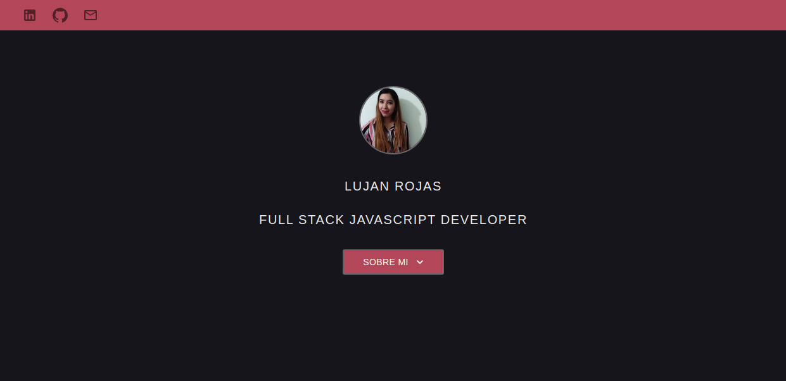
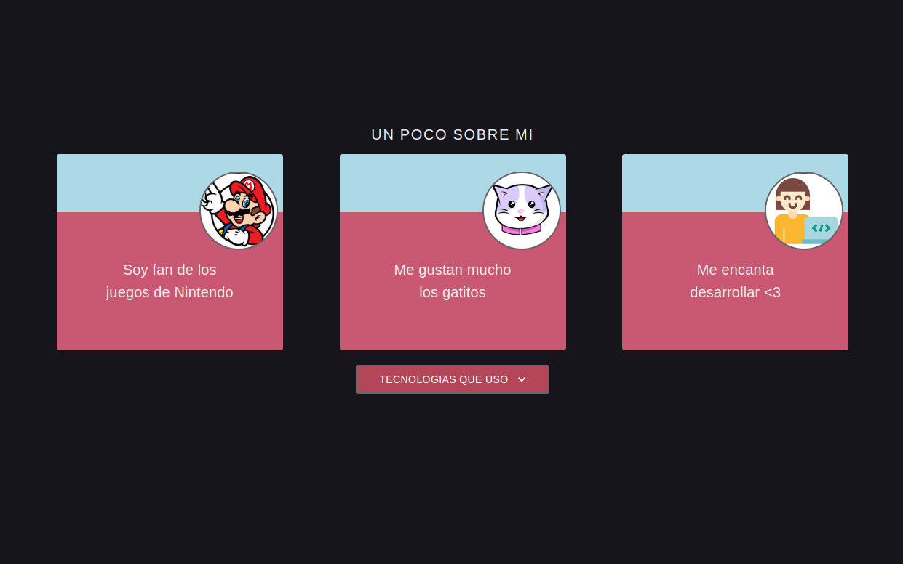

# Mi web :)

*Podes visualizarla en:* https://dracaster.github.io/lushan-web/

*Algunas capturas de pantalla :)*

## Para levantar el proyecto

- Instala dependencias: 

        npm install

- Corré el proyecto:

        npm start

